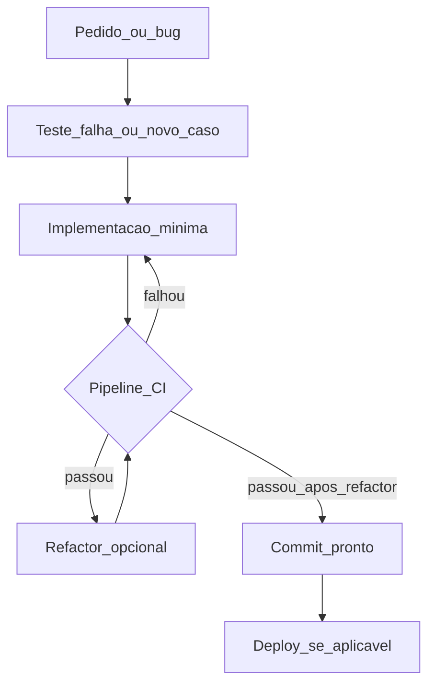

<!-- CONVERSATION_ID: c69a3440-876d-47a5-8392-6069993167fc -->

# Regras de engenharia para agentes: XP, TDD e Clean Code

Este documento é uma **especificação normativa** para humanos e **agentes de IA** que trabalham em projetos de software. Ele combina duas bases do Fabio Akita:

1. **[Do Zero à Pós-Produção em 1 Semana — Bastidores do The M.Akita Chronicles](https://akitaonrails.com/2026/02/20/do-zero-a-pos-producao-em-1-semana-como-usar-ia-em-projetos-de-verdade-bastidores-do-the-m-akita-chronicles/)** (fev/2026): **como implementar** — XP com agente (pair programming), TDD, small releases, CI em todo commit, refactoring contínuo, documento vivo do projeto.
2. **[Clean Code pra Agentes de IA](https://akitaonrails.com/2026/04/20/clean-code-para-agentes-de-ia/)** (abr/2026): **como escrever código** que agentes conseguem ler, grepar, testar e refatorar com baixo custo de contexto e menos regressão.

**Separação factual:** trechos marcados como *(referência: artigo fev/2026)* ou *(referência: artigo abr/2026)* são números, ferramentas ou exemplos citados naqueles textos. O restante são **regras operacionais** generalizadas para qualquer stack (adapte nomes de ferramentas e comandos).

---

## Parte 0 — Mapa mental

| Camada | Pergunta que responde |
|--------|------------------------|
| **Processo (XP/TDD/CI)** | Em que ordem trabalhamos, como validamos, como entregamos sem quebrar a linha principal? |
| **Código para agentes** | Como estruturar nomes, arquivos, tipos, comentários e dependências para o agente (e o CI) operarem bem? |

As duas camadas são **obrigatórias**: processo sem código legível vira retrabalho; código “limpo” sem testes/CI vira mudança plausível que quebra produção silenciosamente.

---

# Parte 1 — Sistema de implementação (XP + TDD + CI)

## 1.1 O que este modelo não é

- **Não é “one-shot prompt”.** Spec enorme em um único passo tende a protótipo sem rede de regressão, sem segurança e deploy habituados, sem iteração real com o mundo.
- **Não é TDD isolado da cultura de time.** TDD aqui vive dentro de **Extreme Programming (XP)**: pair programming (humano + agente), **small releases**, **refactoring contínuo**, **integração contínua** em todo commit.

## 1.2 Papéis: humano e agente

| Papel | Responsabilidade principal |
|--------|---------------------------|
| **Humano (navegador)** | Define **o quê** e **porquê**: objetivo, restrições, quando simplificar ou interromper over-engineering, contexto de domínio fora do repositório. |
| **Agente (piloto)** | Propõe e executa **como**: código, testes, refactors, execução da suíte, pesquisa de RFC/API — sempre sujeito a correção humana. |

**REGRA:** Humano ditando código letra a letra com o agente só digitando tende a **piorar** o resultado. Mantenha o humano na navegação estratégica.

**REGRA:** O agente **não** substitui revisão de produto, segurança e prioridade. Ele tende a aceitar pedidos over-engineered ou inseguros com o mesmo entusiasmo; o humano é o freio.

**REGRA (síntese dos dois artigos):** *Humano decide o quê; agente propõe o como.* Inverter isso piora o resultado.

## 1.3 Definição operacional de TDD

### Ciclo obrigatório por mudança de comportamento

1. **ANTES** de alterar código de produção: escrever ou ajustar **teste** que descreva o comportamento (idealmente **red** quando o framework permitir).
2. Implementar o **mínimo** para o teste passar (**green**).
3. Rodar a **suíte relevante** e, quando existir, o **mesmo pipeline do CI** (linters, auditoria de deps, análise estática de segurança, testes completos).
4. **Refatorar** com suíte verde; preferir **vários commits pequenos** a um megacommit.
5. **NÃO DEVE** integrar commit que quebre o pipeline. *(referência: artigo fev/2026 — cada commit na linha principal passava no CI.)*

### Integrações externas

**DEVE:** Isolar rede, filas, email, APIs com **mocks, stubs ou fakes**.

**NOTA (referência: artigo fev/2026):** Grande parte das linhas não cobertas pelo SimpleCov era integração externa **mockada**; a lógica de negócio tendia a cobertura **bem maior** que a média global.

### Por que TDD com IA é multiplicativo

**REGRA:** Testes são a **rede de segurança das próximas edições do próprio agente**. Sem testes, o agente entrega código plausível que pode quebrar o que funcionava.

*(referência: artigo fev/2026 — CI pegou bugs reais dezenas de vezes em centenas de commits.)*

*(referência: artigo abr/2026 — TDD com agente e CI apertado é descrito como **obrigação técnica**, não só filosofia: o loop escreve → testa → ajusta só funciona se o teste roda headless, sem passos manuais secretos.)*

## 1.4 Métricas de referência e heurísticas

### Do caso M.Akita Chronicles *(referência: artigo fev/2026)*

Use como **baliza**, não dogma:

| Métrica | Valor citado |
|--------|----------------|
| Ratio linhas de teste / linhas de código | **~1,52×** agregado; **> 1×** por app |
| Cobertura de linhas (SimpleCov) | **~82–87%** |
| Cobertura de branch | **~70–73%** |
| Volume de testes | Ordem de **milhar** *(ex.: 1323 testes Ruby)* |

**REGRA interpretativa:** Priorize testes que prendem **regras de negócio e regressões**, não só números.

### Heurísticas para agente *(referência: artigo abr/2026 + síntese operacional)*

- **Arquivos:** manter **abaixo de ~500 linhas**; idealmente **~200–300**. Se um arquivo cresce demais, **extrair** antes de empilhar feature.
- **Funções:** preferir unidades pequenas que caibam em **uma leitura/tool call** sem truncar sentido *(o artigo de abril conecta isso ao custo de contexto e atenção do modelo).*
- **Testes:** deve existir **comando único documentado** (`Makefile`, `package.json`, `pytest`, etc.) que o agente rode **sem** seed manual, credencial não versionada ou passos só “na cabeça de alguém”.
- **Nomes:** se `rg nome` retorna dezenas de ocorrências irrelevantes, o nome está **ruim para o agente**; busque nomes **específicos e únicos**.

## 1.5 Integração contínua e qualidade estática

Pipeline ilustrativo *(referência: artigo fev/2026)*: estilo (ex.: RuboCop) → auditoria de deps (ex.: bundler-audit) → segurança estática (ex.: Brakeman) → testes completos *(ordem de dezenas de segundos no exemplo).*

**DEVE:** Cada commit na linha principal **passa** no pipeline completo.

**DEVE:** Alertas de segurança **corrigidos** ou **documentados** como falso positivo com justificativa.

*(referência: artigo fev/2026 — Brakeman achou SQL injection, path traversal, open redirect antes de produção.)*

## 1.6 Refactoring contínuo

**REGRA:** Refatoração **frequente, pequena e guiada por testes** (extrair serviço, DRY, trocar fonte de dados incorreta, etc.), sempre verde.

**NÃO DEVE:** Acumular features e depois “parar o mundo” para refatorar milhares de linhas **sem** rede de testes.

## 1.7 Contra-exemplo: FrankMD *(referência: artigo fev/2026)*

| Problema | Consequência |
|----------|----------------|
| Features primeiro; testes depois | Testes unitários tardios; cobertura “empurrada” retroativamente. |
| Monólito *(ex.: ~5000 LOC em um controller JS)* | **Seis** refactors “pare tudo”; alto risco. |
| CI não obrigatório a cada commit | Menos feedback antes de integrar. |

**REGRAS para o agente:** não deixar um único arquivo virar bola de lama; não adiar testes sem decisão explícita de dívida; não confiar só em teste de sistema do happy path.

## 1.8 Documento vivo, README e meta-documentação *(síntese: ambos os artigos + abril/2026 explicitamente)*

**DEVE** manter documentação que o agente **relê** antes de agir:

- **`CLAUDE.md` ou equivalente** (`AGENTS.md`, `.cursor/rules`, etc.): denso, imperativo, convenções, comandos, armadilhas — **complementa** testes, não substitui.
- **README** com visão de arquitetura, como rodar testes e setup; diagrama simples (ASCII ou Mermaid) ajuda o agente a achar o “formato” do repo.
- **Scripts de setup idempotentes** (`bin/setup`, `scripts/bootstrap.sh`, …) para máquina limpa.

**NOTA (referência: artigo fev/2026):** O `CLAUDE.md` do caso evoluiu com o projeto (hurdles, padrões, pipeline).

**NOTA (referência: artigo abr/2026):** Meta-arquivos para agentes são *skill* nova: curto, direto, sem prosa; cada linha gasta contexto — **densidade importa**.

## 1.9 Anatomia de uma feature (template)

1. Contexto e investigação (com humano quando necessário).
2. Desenho **mínimo** — humano pode pedir simplificação *(ex.: máquina de estados de email reduzida).*
3. **Testes** dos fluxos relevantes (sucesso, falha, limites).
4. Implementação mínima.
5. Pipeline completo verde.
6. Deploy / validação conforme o projeto.

**Exemplo *(referência: artigo fev/2026)*:** List-Unsubscribe (RFC 8058): pesquisa → headers e endpoint → testes dos fluxos → CI → deploy.

## 1.10 Fluxo visual (referência)



---

# Parte 2 — Clean Code orientado a agentes de IA

O leitor primário de muito código novo é um **agente** (leitura por fatias, grep, tool calls). Restrições citadas *(referência: artigo abr/2026)* incluem: truncamento de leitura por arquivo, atenção que degrada com contexto cheio, custo de tokens por `Read`/`Edit`/`Bash`, latência por iteração, preferência por busca lexical (`rg`) em vez de carregar arquivo inteiro.

## 2.1 Ordem de prioridade (re-ranqueamento)

Da **mais** crítica à menos (itens de baixo continuam importando; os de cima passam a pesar **muito** mais com agentes):

1. **Funções pequenas e arquivos pequenos** — unidade de sentido cabe em uma leitura; alinha com a “unidade de processamento” do modelo.
2. **SRP (Single Responsibility Principle)** — um módulo, uma razão para mudar; facilita teste focado e grep previsível.
3. **Nomes significativos, únicos e “grepáveis”** — a navegação lexical é API primária do agente.
4. **Comentários com contexto e proveniência (PORQUÊ)** — bug de produção, constraint de negócio, issue, commit; **não** legenda do óbvio (ver §2.11).
5. **Tipos explícitos** — reduzem inferência errada *(TypeScript vs JS puro; type hints em Python; RBS em Ruby, etc.).*
6. **DRY** — duplicação aumenta risco de o agente atualizar uma cópia e esquecer outras.
7. **Testes que o agente consegue rodar** — comando único, output previsível, sem ritual humano *(alinhado à Parte 1).*
8. **Estrutura de diretório previsível** — convenções de framework ou padrão estável do repo.
9. **Injeção de dependências (DI) e testabilidade** — dependências injetáveis em vez de hardcode interno; facilita fakes.
10. **Evitar aninhamento profundo** — early returns, guard clauses, flatten; menos estado mental por indentação.
11. **Erros com contexto** — mensagens com valor recebido vs. formato esperado; o agente usa stack trace como sinal.
12. **Formatação e estilo** — delegar ao formatador padrão da linguagem (Prettier, Black/Ruff, gofmt, cargo fmt, rubocop -A, …); consistência reduz ruído.
13. **Comentário óbvio** — continua **proibido**; desperdiça tokens e não agrega.

## 2.2 Comentários: inversão em relação ao Clean Code clássico *(referência: artigo abr/2026)*

**DEVE** documentar **intenção, trade-offs e proveniência** onde o código sozinho não carrega essa informação.

**DEVE** manter comentários/docstrings úteis em refactors — não “podar” contexto que o próprio agente gerou para leituras futuras, salvo se forem **óbvios** ou redundantes.

**DEVE** em API pública: docstring com intenção + **um exemplo de uso** quando fizer sentido.

**NÃO DEVE** comentar o que a sintaxe já diz (`// incrementa i` acima de `i++`).

## 2.3 DRY, DI e configuração

**REGRA:** DRY não é só estética — é **segurança de refactor automatizado** com agente.

**REGRA:** Preferir **DI** (parâmetros, construtor, factory) a instanciar dependências “no meio” da lógica; facilita `FakeX` nos testes sem monkey-patch frágil.

**REGRA:** Constantes de configuração (modelo LLM, URLs, feature flags) **centralizadas** — evita o antipadrão “mesmo valor hardcoded em N arquivos” citado *(referência: artigo abr/2026 — commit que tocou muitos arquivos para centralizar config).*

## 2.4 Logging e observabilidade *(referência: artigo abr/2026)*

**DEVE:** Para debug/observabilidade entre serviços, preferir **log estruturado** (ex.: JSON com campos nomeados) que o agente possa filtrar e correlacionar.

**DEVE:** Expor **comandos previsíveis** de validação (`make ci`, `pnpm test`, `pytest`, …) no README e/ou `CLAUDE.md`.

## 2.5 Código defensivo e robustez operacional *(referência: artigo abr/2026)*

O agente tende a implementar o **caminho feliz** e só cobrir circuit breaker, retry com backoff, timeouts, degradação graciosa **quando pedido**.

**REGRA:** Se o projeto exige essas categorias, **listar explicitamente** em `CLAUDE.md` / regras do agente; caso contrário, tratar ausência como dívida consciente.

---

# Parte 3 — Checklist operacional unificado (cada tarefa)

**ANTES de editar**

- [ ] Localizar **módulo/função** com responsabilidade clara (SRP).
- [ ] Se o arquivo está grande, **planejar extração** antes de crescer mais.
- [ ] Garantir que existe **comando documentado** para testes e CI local.

**Durante a mudança**

- [ ] **Teste** novo ou ajustado descreve o comportamento (red quando possível).
- [ ] Implementação **mínima** para verde.
- [ ] Nomes **específicos**; tipos explícitos onde a stack suportar.
- [ ] Sem duplicação desnecessária; dependências **injetáveis** para I/O externo.
- [ ] Comentários só com **PORQUÊ / proveniência**; sem comentário óbvio.
- [ ] Erros com **contexto** (valores, expectativa).
- [ ] Formatação via **ferramenta padrão** do projeto.

**Depois de editar**

- [ ] Rodar testes + pipeline local equivalente ao CI.
- [ ] Refatorar se necessário, **suíte verde**.
- [ ] Atualizar **`CLAUDE.md` / README** se novas armadilhas, comandos ou decisões arquiteturais surgiram.
- [ ] Commits **pequenos** e reversíveis.

---

# Parte 4 — Anti-padrões proibidos (consolidado)

**NÃO DEVE:**

- “One-shot” gigante sem iteração, testes e CI.
- Arquivo monolítico ou funções enormes que forçam leitura paginada e modelo fragmentado.
- Nomes genéricos (`data`, `handler`, `Manager`, `Service`) que explodem resultados no grep.
- Duplicar lógica em vários arquivos sem fator comum.
- Hardcode de config espalhado; instanciar dependências internamente sem ponto de substituição em teste.
- Testes que dependem de **setup manual**, segredos fora do repo ou estado não reprodutível.
- Omitir teste de **regressão** em correção de bug.
- Integrar com CI vermelho “para consertar depois”.
- Comentários que só repetem a sintaxe; logs vagos (`invalid input` sem o que foi recebido).
- Estilo inconsistente entre arquivos quando já existe formatador acordado.

---

# Parte 5 — O que a IA tende a fazer bem vs. mal

### Faz bem *(aproveitar)*

- Boilerplate, scaffolding, refactors mecânicos rápidos.
- Testes com edge cases **quando** o contrato está claro.
- Pesquisa de RFC/API e consistência com padrões do repo.

### Faz mal *(exigir freio humano ou regra explícita)*

- **Over-engineering** (ex.: máquinas de estado e filas além do necessário — *referência: artigo fev/2026*).
- **Segurança só reativa** ao pedido (SSRF, rate limit, criptografia, etc.).
- **Caminho feliz** sem resiliência operacional, se não estiver listado nas regras do projeto.
- **Duplicação** e **config espalhada** — o agente pode atualizar uma cópia e esquecer outras.
- **Opiniões suavizadas** em prompts/conteúdo sem instruções explícitas *(contexto: artigo fev/2026).*
- **Priorização fraca** — executa qualquer pedido com o mesmo entusiasmo; o humano define o que não fazer.

---

# Parte 6 — Template denso para colar em `CLAUDE.md` (ponto de partida)

*(Adaptado do artigo abr/2026; traduzido e condensado — ajuste comandos e stack.)*

```markdown
## Estilo de código

- Funções: ~4–20 linhas; quebrar se crescer demais.
- Arquivos: <500 linhas; ideal ~200–300; dividir por responsabilidade.
- Uma coisa por função; uma razão para mudar por módulo (SRP).
- Nomes: específicos e únicos. Evitar `data`, `handler`, `Manager`.
  Preferir nomes cujo `rg` retorne poucos hits irrelevantes.
- Tipos: explícitos. Evitar dinamismo sem anotação onde a linguagem permitir.
- Sem duplicação: extrair função/módulo compartilhado.
- Early returns em vez de `if` aninhado profundo. Preferir <=2 níveis de indentação na lógica principal.
- Mensagens de erro: incluir valor recebido e formato/contrato esperado.

## Comentários

- Preservar comentários com intenção e proveniência em refactors.
- Escrever PORQUÊ, não O QUÊ. Proibir comentário óbvio.
- Docstrings em API pública: intenção + um exemplo de uso.
- Referenciar issue/commit quando uma linha existe por bug ou limitação externa.

## Testes

- Um comando documentado roda todos os testes relevantes: `<substitua>` .
- Toda função nova com teste; todo bugfix com teste de regressão.
- Mockar I/O externo com fakes nomeados, não só stubs inline frágeis.
- Testes F.I.R.S.T: rápidos, independentes, repetíveis, auto-validáveis, oportunos.

## Dependências

- Injetar dependências (parâmetro/construtor), evitar singletons globais para I/O.
- Envolver bibliotecas de terceiros em interface fina do projeto quando acoplam demais.

## Estrutura

- Seguir convenções do framework (Rails, Django, Next.js, …).
- Módulos pequenos e previsíveis em vez de “god files”.

## Formatação

- Usar formatador padrão da linguagem. Não debater estilo além disso.

## Logging

- JSON estruturado para debug/observabilidade; texto simples só onde for saída humana deliberada.
```

---

# Parte 7 — Resumo normativo final

- **DEVE** seguir o ciclo TDD + CI da Parte 1 em todo comportamento novo ou alterado.
- **DEVE** escrever código segundo a Parte 2 para maximizar navegação, teste e refactor por agentes.
- **DEVE** manter `CLAUDE.md` / README / scripts de setup como **interface operacional** do repositório para o agente.
- **NÃO DEVE** integrar sem verde no pipeline nem crescer arquivos além das heurísticas sem plano de extração.
- **NÃO DEVE** remover comentários que carregam **proveniência** sem substituir por teste ou documentação equivalente.

---

## Citação *(referência: artigo fev/2026)*

> “A IA é seu espelho, ele revela mais rápido quem você é. Se for incompetente, vai produzir coisas ruins mais rápido. Se for competente, vai produzir coisas boas mais rápido.” — Fabio Akita

---

*Adapte ferramentas (RuboCop, Brakeman, pytest, ruff, etc.), comandos e limites de tamanho ao seu repositório. Fontes: artigos AkitaOnRails de fev/2026 e abr/2026 listados no topo.*


# Adendo à rules.md: Segurança, Pentest e Testes Negativos

Este documento é uma síntese dos aprendizados obtidos durante a auditoria de segurança e conformidade LGPD da plataforma SaaS (Fases 13 a 17). Ele deve ser lido como um complemento normativo para garantir que agentes de IA e humanos mantenham o "Bunker de Segurança" construído.

---

## 1. O Princípio da Fronteira de Permissão (RBAC)

**O que aprendemos:** A cobertura de 100% em TDD pode ser enganosa se focar apenas no "Caminho Feliz". A vulnerabilidade de autorização do B2B Admin provou que o código pode estar "coberto", mas logicamente exposto.

**REGRA:** Todo teste de funcionalidade administrativa **DEVE** incluir cenários onde papéis vizinhos (ex: B2B Admin tentando agir como Instrutor) são explicitamente bloqueados.
- Não teste apenas quem *pode*. Teste rigorosamente quem *não deve poder*.

---

## 2. Testes Negativos de Espectro Completo

**O que aprendemos:** APIs são vetores de manipulação de estado. O caso do "Heartbeat Negativo" mostrou que validações de banco de dados (`numericality`) são a última linha de defesa, mas o Controller deve ser o primeiro filtro.

**REGRAS PARA AGENTES:**
1. **Validação de Sinais:** Sempre teste inputs numéricos com valores negativos, zero e excessivamente altos.
2. **Integridade de Relacionamento (IDOR):** Teste se o sistema aceita IDs válidos que pertencem a outros usuários. O sistema deve retornar `403` ou `404`, nunca processar dados cruzados.
3. **Estado de Recurso:** Teste o acesso a recursos em estados inválidos (ex: aulas de um curso com matrícula cancelada).

---

## 3. Infraestrutura como Código Seguro (Pentest)

**O que aprendemos:** Configurações padrão de frameworks nem sempre são suficientes para ambientes de alta conformidade. O "Super Pentest" revelou a necessidade de hardening explícito.

**REGRAS OPERACIONAIS:**
1. **Security Headers:** Cabeçalhos como `CSP`, `HSTS` e `X-Frame-Options` devem ser testados via integração (`headers_spec.rb`). Se o teste falhar, o deploy deve ser bloqueado.
2. **Modo Paranoico:** Em sistemas com dados sensíveis, a enumeração de usuários deve ser impedida. Configure o sistema de autenticação para não revelar se um e-mail existe ou não na base.
3. **Content-Security-Policy (CSP):** Mantenha uma política estrita. Agentes não devem adicionar scripts externos sem atualizar a política de CSP correspondente.

---

## 4. O Checklist de Segurança do Agente

Antes de considerar uma tarefa concluída, o agente deve se perguntar:
- [ ] Eu testei esse endpoint sem estar logado?
- [ ] Eu testei esse endpoint com um usuário que não é o dono do recurso?
- [ ] Eu tentei enviar parâmetros que não estão no formulário (Mass Assignment)?
- [ ] Eu tentei enviar valores negativos ou malformados para as APIs?
- [ ] Os dados exportados (JSON/CSV) contêm PII de terceiros?

---

*"A segurança não é um produto, é um processo. O TDD é a nossa rede, o Pentest é a nossa lança."*

---

# Adendo à rules.md: Padrões de UI e Modding Aditivo

Este adendo descreve padrões de implementação para garantir que mods de interface (UI) não degradem a experiência original do jogo e coexistam com sistemas nativos.

---

## 1. O Princípio da Restauração de UI (Quick Menu)

**O que aprendemos:** Substituir o `screen quick_menu` para adicionar botões de mod frequentemente remove funcionalidades essenciais (Save, Load, Skip, Auto) se não for feito com cuidado.

**REGRA:** Ao modificar o `quick_menu`, **DEVE** garantir que todos os botões originais do jogo sejam preservados.
- **DICA:** Verifique os arquivos originais (ex: `screens.rpy` ou extraídos de `scripts.rpa`) para identificar a lista completa de botões (`Rollback`, `History`, `Skip`, `Auto`, `Save`, `Q.Save`, `Q.Load`, `Prefs`).
- **ESPECÍFICO:** Se o jogo suportar variantes (ex: `variant "touch"`), ambas devem ser atualizadas para manter a paridade de recursos.

---

## 2. Modding Aditivo de Hints (Escolhas)

**O que aprendemos:** Sobrescrever o `screen choice` para exibir dicas de mod pode "cegar" o jogador para as dicas nativas que o jogo já fornece.

**REGRA:** O sistema de dicas de mod deve ser **aditivo**, não substitutivo.
- **IMPLEMENTAÇÃO:** O `screen choice` modificado deve verificar `persistent.hintsEnabled` (ou flag equivalente do jogo) e processar os `kwargs["hint"]` nativos do motor Ren'Py, concatenando-os à legenda do botão se existirem.
- **LEGIBILIDADE:** Respeite o `persistent.dialogueTextOutlines` se o jogo original o utilizar, garantindo que o texto do mod não seja o único sem contorno/legibilidade.

---

## 3. Renderização de Tags e o Perigo do '!q'

**O que aprendemos:** O uso da flag de interpolação `!q` (quoting) em botões de escolha impede que o Ren'Py processe tags de texto como `{color}`, `{font}` ou ícones (emojis/assets).

**REGRA:** Use interpolação direta `[variável]` em vez de `[variável!q]` em botões de menu quando a legenda puder conter formatação ou ícones nativos do jogo.

---

## 4. Estrutura de Execução em Raiz (Root-Level)

**O que aprendemos:** Manter scripts de execução (`.bat`) apenas dentro da pasta `game/` é pouco intuitivo para o usuário final e dificulta o uso de ambientes virtuais (`.venv`) localizados na raiz do workspace.

**REGRA:** Forneça scripts de inicialização na **raiz do diretório do jogo** (ao lado do `.exe`).
- **PADRÃO:**
  - `run_backend.bat`: Inicia apenas o servidor TTS (robusto, detecta `.venv`).
  - `JOGAR_COM_TTS.bat`: Inicia o backend e o jogo simultaneamente em janelas separadas.

---

*"Um mod de UI bem sucedido é aquele que o jogador esquece que é um mod, sentindo-se parte integrante do jogo original."*
